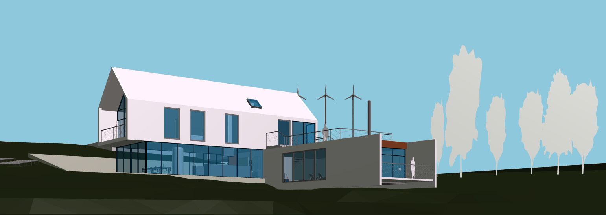

# Synchroniza 3D App Visualizer

Synchroniza App Visualizer is a cutting-edge 3D visualization software designed to enhance understanding of construction projects for the entire crew. This tool not only lets you view intricate 3D models, but also dives deep into the nitty-gritty details of construction blueprints.

## Main Features

- **3D Visualizations**: Generate detailed and lifelike 3D representations of your construction projects.
  
- **Federation Files**: Create clash detection files for a more streamlined construction process.
- **IFC File Properties**: Dive into the properties of Industry Foundation Classes (IFC) files with ease.
- **Clipping Planes**: Clip and view your 3D models from any direction to better understand its composition.
- **Floor Plans Creation**: Generate detailed floor plans to guide your construction crew.
- **Dimension Measurement**: Measure any 3D element directly within the software.


## Tecnologies

- **Programing Languages**:
  
  

- **Libreries**:
  
          


- **Tools and Platffomrs**:
  
   


## Installation

To get a copy of this project and run in your local environment follow the steps listed bellow:

1. Clone GitHub repository
   
   ```sh
   git clone https://github.com/BasCalvaro/Synchroniza.git
   ```
2. npm run star

    ```sh
    Open http://localhost:3000 to view it in the browser.
    ```


---
Made with ❤️ by [Alvaro Basoalto/Pedro Barahona/Syncroniza](https://syncroniza.cl).
